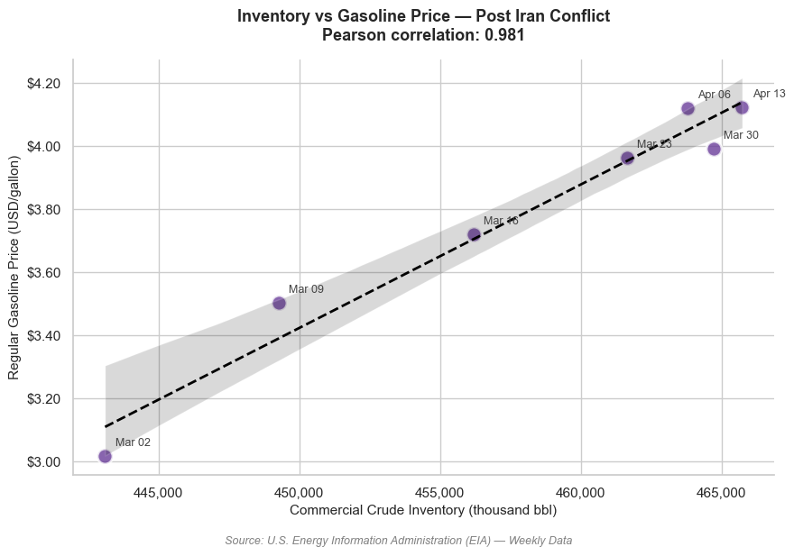
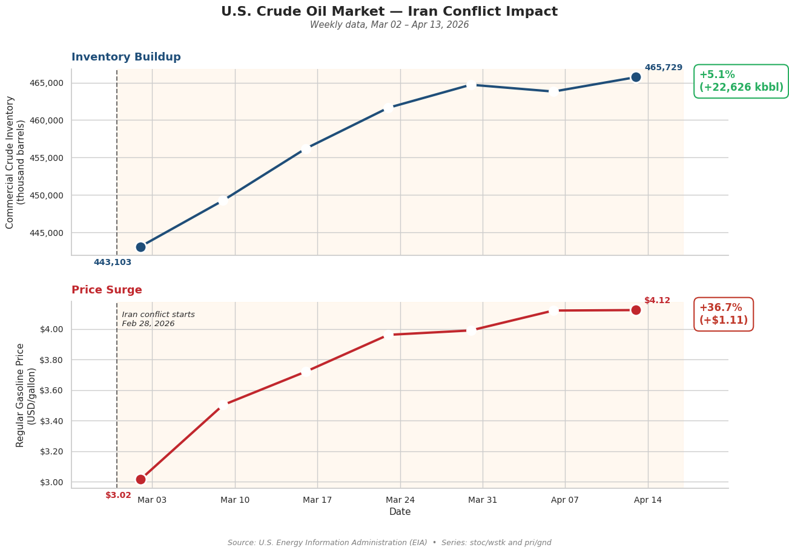

# How quickly are changes in crude oil inventories passed on to pump prices?

A short data analytics case study using the U.S. Energy Information Administration (EIA) API to explore the relationship between weekly crude oil inventories and retail gasoline prices in the United States — focused on the period right after the Iran conflict began on **February 28, 2026**.

The textbook answer says rising inventories should push prices down. The data tells a different story: between February 28 and April 13, 2026, **commercial crude inventories grew by ~5%** and **regular gasoline prices jumped by ~37%** at the same time, with a Pearson correlation of **0.98**.

This is a classic case of confounding: both variables are reacting to the same underlying force — geopolitical risk — rather than one driving the other.

---

## Preview





---

## Stack

- Python 3.12
- `requests` — EIA API calls
- `pandas` — data wrangling
- `matplotlib` + `seaborn` — visualizations
- `python-dotenv` — environment variables for the API key

---

## Project structure

```
.
├── oil_inventories_vs_gas_prices.ipynb   # Main notebook
├── output/                                # Generated charts and CSVs
├── requirements.txt
├── .env.example                           # Template for environment variables
├── .gitignore
└── README.md
```

---

## Setup

1. Clone the repo and enter the folder:

```bash
git clone https://github.com/<your-username>/oil-iran-shock.git
cd oil-iran-shock
```

2. Install dependencies:

```bash
pip install -r requirements.txt
```

3. Get a free API key from the EIA: https://www.eia.gov/opendata/register.php

4. Create a `.env` file from the template and paste your key:

```bash
cp .env.example .env
```

Edit `.env`:

```
EIA_API_KEY=your_key_here
```

5. Open the notebook and run all cells:

```bash
jupyter notebook oil_inventories_vs_gas_prices.ipynb
```

---

## EIA endpoints used

| Endpoint | Description |
|----------|-------------|
| `/v2/petroleum/stoc/wstk/data/` | Weekly crude oil stocks (excluding SPR) |
| `/v2/petroleum/pri/gnd/data/`   | Weekly retail gasoline prices         |

Filters used: `duoarea=NUS` (U.S. national average), `product=EPC0` (crude oil) for inventories, and `product=EPMR` (regular gasoline) for prices.

---

## Key findings

| Metric | Feb 28, 2026 | Apr 13, 2026 | Change |
|--------|--------------|--------------|--------|
| Commercial crude inventory | 443,103 kbbl | 465,729 kbbl | +5.1% |
| Regular gasoline price | $3.02/gal | $4.12/gal | +36.7% |
| Pearson correlation | — | — | **0.98** |

**Interpretation:** during a geopolitical shock, the simple supply-and-demand relationship between inventories and prices breaks down. Refineries stockpile crude as a precaution, while traders price in a risk premium that flows from futures to the pump. Both effects move in the same direction at the same time.

To isolate the true effect of inventories on prices, the analysis would need to control for a measure of geopolitical uncertainty (for example, the Caldara & Iacoviello Geopolitical Risk Index).

---

## License

MIT — feel free to fork, adapt, and share.

---

## Contact

If you have questions or want to discuss the approach, feel free to reach out on [LinkedIn](https://www.linkedin.com/in/deunich/).
